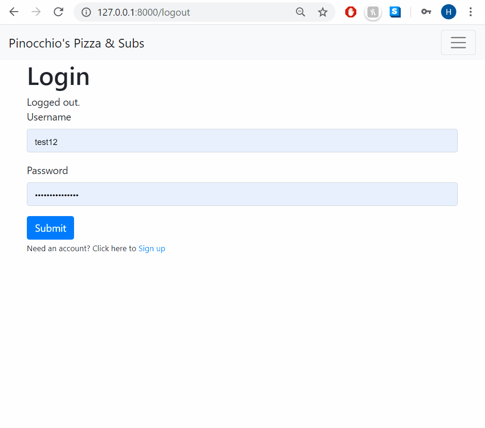

# Pinocchio's

Web Programming with Python and JavaScript

This is a web application for a Pizza Restaurant website using Django.

On this web app, users can :
- Register, login, browse the menu and items to their cart. 
- If appropriate, they can add topping and extras.
- Once an order is complete, user can decide to place an order. 

After submission, the items will be remove from the current cart and the site administrator can:
- See a new order on the admin interface that he/she can mark as completed.
- Add or update category and name of product if needed.

## Install

Activate virtual environment:

`$ env\Scripts\activate`

Check if Django is already installed:

`$ python -m django --version`

If not: https://docs.djangoproject.com/en/3.0/topics/install/

`$ python manage.py runserver`

Copy paste the URL link to your web browser

`Starting development server at http://127.0.0.1:8000/`

To go to the admin interface, add /admin/ to the root URL: http://127.0.0.1:8000/admin/

To create a superuser, follow this tutorial: https://docs.djangoproject.com/en/1.8/intro/tutorial02/

To visualize this web app, check out this video https://www.youtube.com/watch?v=nhwRe9PW50k&t=48s

## Django models
For this project I created 8 models:
* Category : To differentiate items and allow the customization of topping, size and extra.
* Size : Small and Large
* Topping + Extra : To see the list of items
* Price_List : To determine a base price and supplement price (if large option)
* Item_List : Which list the name of article and associate it with the price list
* Cart_List : To allow users to add and remove items to their cart
* Order : To see the orders placed
